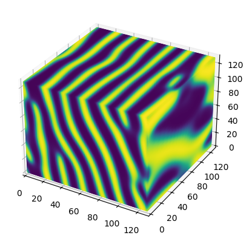

# coLamB


## Installation

To install this package, you need to first ensure that CuPy is correctly installed in your environment. CuPy requires a specific installation depending on your CUDA version.

### Step 1: Install CuPy

Since you are using CUDA, please refer to the official CuPy installation guide to install the appropriate version of CuPy for your system:

[CuPy Installation Guide](https://docs.cupy.dev/en/stable/install.html)

Follow the instructions on the CuPy website to install the version of CuPy that is compatible with your CUDA setup. This will typically involve selecting the correct `cupy-cuda` package based on your CUDA version.

### Step 2: Install this package

Once CuPy is installed, you can proceed to install this package:

```bash
pip install git+https://github.com/Tan-Furukawa/coLamB.git
```

## Example Usage

After successfully installing the package, you can use the following sample code to get started:

```python
from coLamB import CoherentBinary3D, DataSet

# Initialize the dataset
dataset = DataSet()

# Create an instance of CoherentBinary3D with the specified parameters
feldspar = CoherentBinary3D(
    "result",                     # Output directory or file name
    stiffness=dataset.stiffness,  # Stiffness data from the dataset
    chemical_strain=dataset.ei0,  # Chemical strain data from the dataset
    method="linear",              # Method to be used (linear in this case)
)

# Set the temperature (in Kelvin)
feldspar.T = 500 + 273

# Set the initial concentration
feldspar.c0 = 0.35

# Set the time increment for each step
feldspar.dtime = 0.1

# Set the print interval
feldspar.nprint = 300

# Execute the simulation
feldspar.exec()


